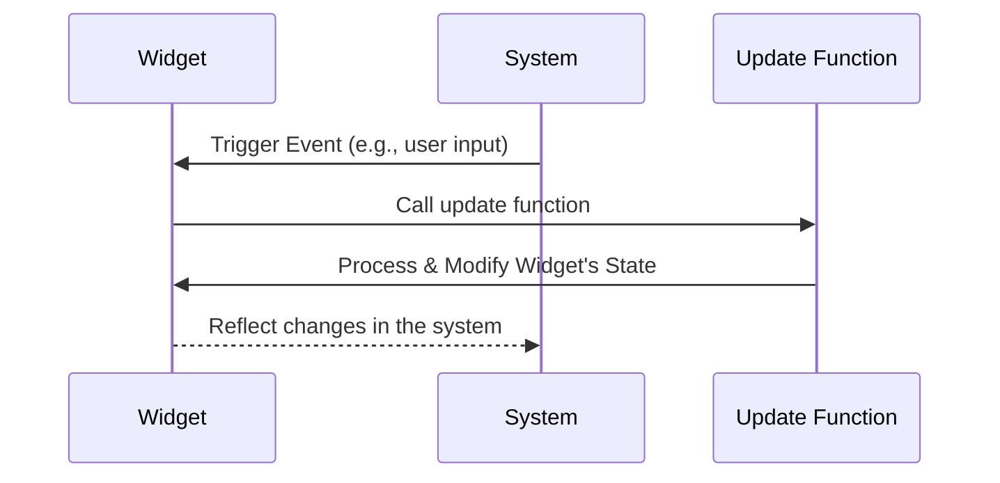
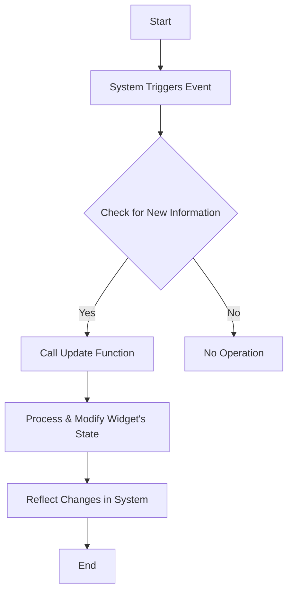

# Blocking Operations and Updates

Ensuring seamless and efficient operations in any system requires a well-defined mechanism for managing updates. In the context of our widgets, there is a fundamental rule that governs the flow of new information and the subsequent state changes: the **STANDARD UPDATE MECHANISM**.

## The Invariant Principle

Our design operates on a singular, unwavering principle: Every update directed at a widget must exclusively come through the STANDARD UPDATE MECHANISM. What this encapsulates is that the `update` function is the sole gateway for any change in the widget's state.

To put it succinctly:

- **New Information**: Any data or detail that isn't instantly accessible by the widget through its own fields.
- **Rule**: Such "NEW information" is only introduced to the widget via the `update` function.

## Mermaid.js Diagrams
Here are the mermaid.js diagrams to visually represent the flow of operations and updates:

