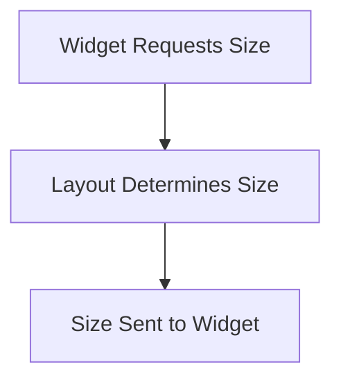

# Rethinking Layout Strategy

This document delves into the reconsideration of the "visible hint" reliance within the layout strategy.

## SizePolicy Explained

The **SizePolicy** governs how a **Widget** uses available space. It can either be:

Determined by the widget itself (DeterminedBy::Widget)
Dictated by the layout (DeterminedBy::Layout)
The final widget size determination follows this matrix:

```mermaid
table TD
    header
        |             | DeterminedBy::Widget     | DeterminedBy::Layout |
    row
        | Some(max_x) | Widget uses size.x space | Uses exact max_x space |
    row
        | None        | Widget uses size.x space | Warning emitted |
```

This raises a question: if the SizePolicy is determinant, do we even need a return result for widget size? The size can be inferred, making the SizeConstraint in layout somewhat redundant.

The subsequent question is: Should the SizePolicy setting belong to the widget or the layout?

## The Role of visible_hint()
The SizeConstraint's `visible_hint()` is utilized by:

- Editor: For hover positioning
- WithScroll: To determine margin width for line numbers
- BigList and List: For culling

Two options arise:

### Option 1: Using "decided size" WITHOUT visible_hint
- Hover positioning near screen edges in Editor becomes problematic.
- WithScroll adopts a fixed margin width.
- Lists spend extra time rendering off-screen items.

## Option 2: Using "decided size" WITH visible_hint
- No changes in Editor, Scroll, or Lists.

Option 2 was selected, but issues emerged:

The SizePolicy shifted to Layout, creating challenges for WithScroll acting as a widget. This is due to size determination ambiguities.

There's a potential solution: Let the widget declare an "as much as possible" full size. However, issues re-emerge with scroll functionality, as a scroll signifies no size limits.

The information flow must begin from the TOP, i.e., from the Layout, since only the screen size is preset.



Several considerations emerge:

1. Transform WithScroll into a Layout.
2. Widgets return a size pair: True full size & alignment preference.

## Final Thoughts

This revised strategy streamlines the Editor, Scroll, and List functionality. The Scroll can inquire about the true size from the widget beneath and then make decisions accordingly.

While promising, some bugs were identified, including slowdowns and issues with treesitter/highlighting at the file's end. Further refinements are needed to optimize this new layout approach.

