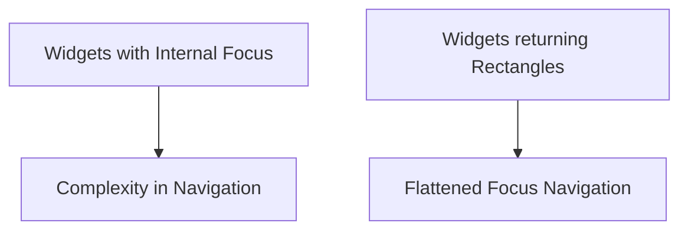
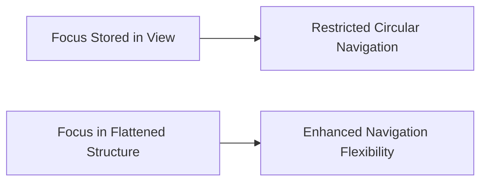
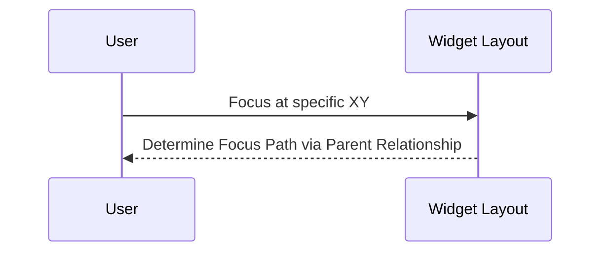
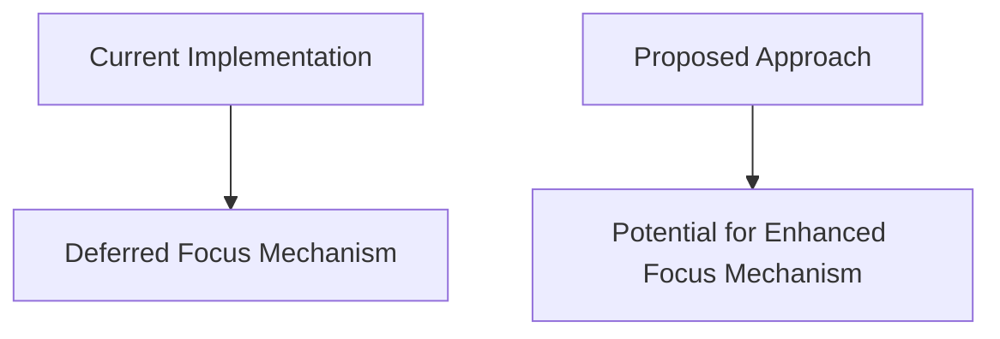

# Rethinking Focus in Widgets
A fresh perspective on how focus is managed within widgets has emerged. It may be beneficial to reconsider the traditional approach of storing focus within widgets themselves.

## 1. Decoupling Focus from Widgets
The thought has arisen that perhaps widgets shouldn't retain focus. Instead, widgets could simply return the rectangles of unblocked (by hover) receiving objects. The user would then navigate the focus among a flattened collection of these rectangles, given that there's a guarantee they don't overlap.

## 2. Circular Focus Navigation
Storing focus within a view leads to a paradox when dealing with grid-like structures, preventing a circular focus navigation. By transitioning to a flattened structure, it aligns well with the concept of an "anchor" or a "special cursor".

## 3. Focus Path Definition
With complex layouts, such as nested rectangles, accessing the center rectangle in a flat hierarchy can be challenging. However, current layouts don't permit such designs. Thus, the focus path is only defined in terms of user's "attention" at a specific XY coordinate, and the escalation path is determined solely by the "parent" relationship.

## 4. Future Implementation Considerations
While this new focus approach offers many advantages, it significantly deviates from the current implementation (as of 24th May). This means it's unlikely to be incorporated by the alpha release. However, it's essential to ensure that "set focus" works even if invoked before a redraw. There should be a fallback mechanism in case the focus is lost. Currently, this is managed through "deferred focus", but with the accumulated knowledge, a more refined solution might be on the horizon.

