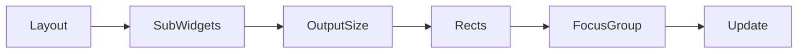
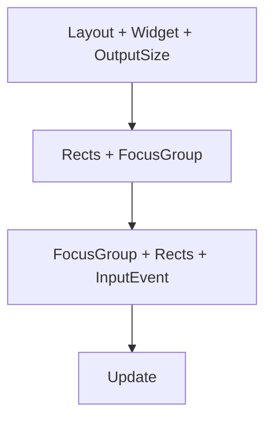

# Analyzing Dependencies Within View

During the development of the SaveFileDialog, we identified certain constraints that underpin the interactivity and layout of the system.

## Core Constraints:

1. **Layout Dependency on SubWidgets**: The primary layout needs to access SubWidgets to determine their minimum size.
2. **OutputSize Requirement**: The layout requires an OutputSize that yields a list of Rectangles (Rects). These Rects will encapsulate only specific SubWidgets from the layout, though not necessarily all.
3. **FocusGroup Generation**: From the derived Rects, we can generate a FocusGroup.

In a summarized equation:

The flow above depicts the dependency chain and how each component contributes to the final update, ensuring smooth interaction and a coherent display for the user.