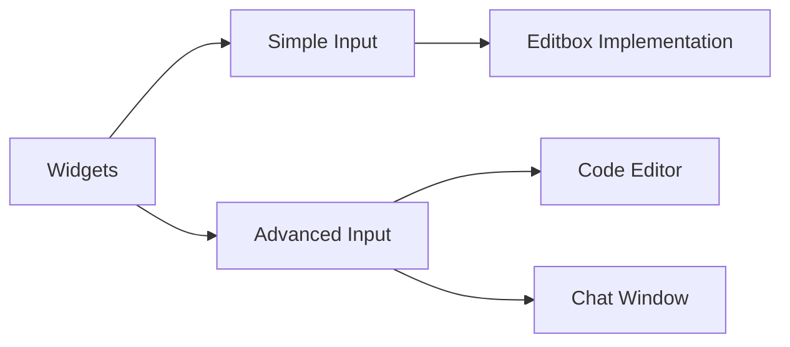
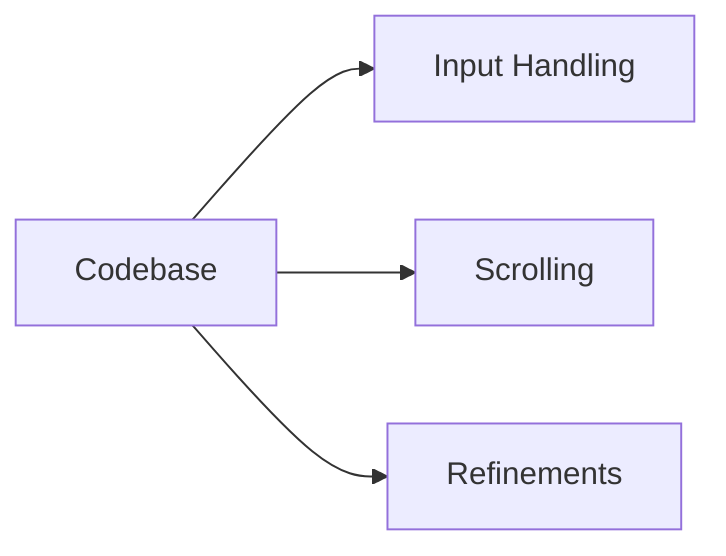

# Pending Tasks: Enhancements and Fixes
The following document outlines the tasks that are currently pending, with the aim to improve efficiency, enhance functionality, and rectify issues within the application.

## Input Handling
### Objective: Enhance Reusability
- **Simple Input**:
    - Many widgets will be handling input.
    - Implementation of simple input is targeted for the editbox. If this isn't sufficient, the code should be transitioned into a reusable sub-component.
- **Advanced Input**:
    - This involves the editor input which is more complex.
    - The goal is to implement it in a reusable manner. This is to ensure powerful editing capabilities are available in both the code editor (with features like coloring, autocomplete, etc.) and in other contexts like a chat window implemented by a plugin.

## Scrolling Limitation
### Objective: Address Scroll Limitation
- The current limitation is set to a `u16` number of lines.
- For files longer than 65k lines, consider implementing a separate widget. Large file parsing might not be frequent, but the application should be prepared to handle such instances.

## Code Refinements
### Objective: Enhance Code Efficiency and Prevent Errors
- Change every instance of `new_idx < sth.size() - 1` to `new_idx + 1 < sth.size()` to avoid underflow issues when `sth.size` is zero.
- Explore the integration of `smallvec` for the cursor set.
- In the definition of the fuzzy file item provider, consider removing the second `Box` and directly return `&dyn Item`.
- Transition from `Rope` to `Buffer` in the Edit Box, but ensure newlines are blocked.
