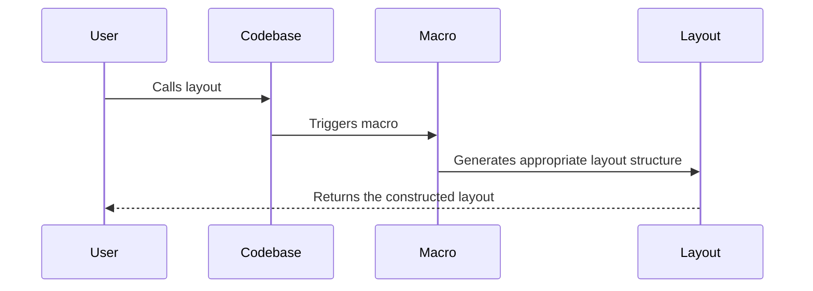
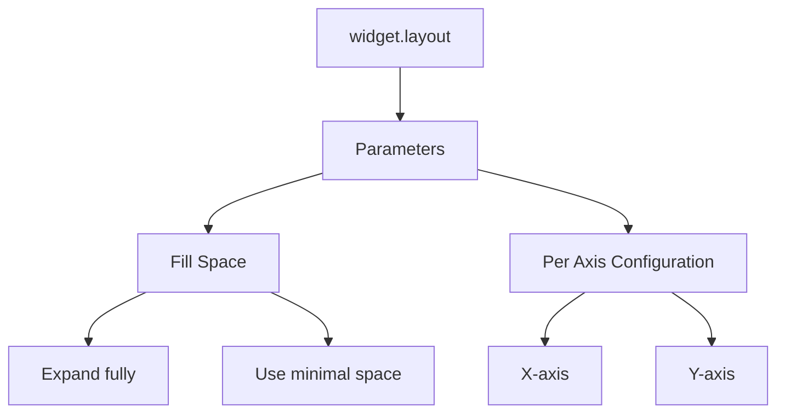
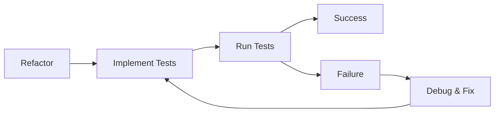

# Refactoring Guidelines for Improved System Design
In the continuous endeavor to enhance the codebase's clarity and maintainability, certain elements stand out as prime candidates for refactoring.

## Layouts via Macros:
Instead of manually defining layouts, employing macros can dramatically streamline the process, making it both more concise and readable.

## Enhanced Widget Layout:
The `widget.layout` method can be augmented to accept parameters determining its spatial behavior:

- **Fill Space Parameter**: This would dictate whether the widget should expand to fill all available space or minimize its footprint.
- **Per Axis Configuration**: Allow for individual axis control, enabling the widget to expand or contract differently along the x and y axes.

## Testing:
Introducing these changes without adequate tests could introduce unforeseen issues. Thus, it's vital to accompany these refactoring efforts with simple, clear tests that ensure functionality remains consistent and bugs are swiftly identified.

