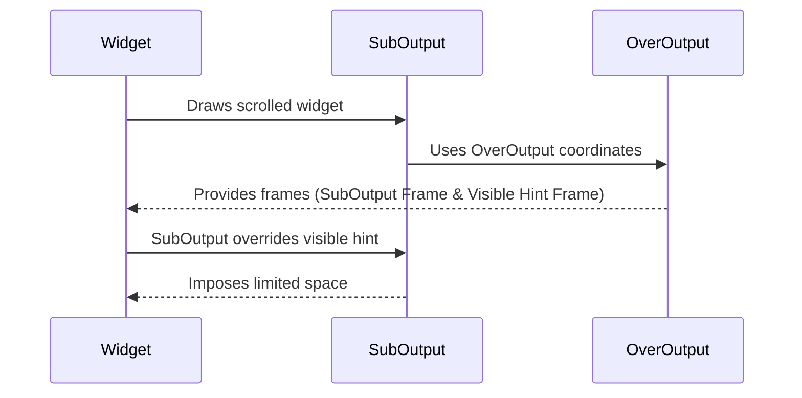

# Challenges with Scrolling Mechanism
The existing design for the scrolling widget encounters a problem when utilizing a sub-output for rendering. The core of the issue lies in the intersection of the `SubOutput` and `OverOutput` mechanisms, which inadvertently disrupts the scrolling behavior.

## The Problem:
1. **Sub-Output Integration**: Drawing a scrolled widget using sub-output results in the breaking of the scrolling mechanism.
2. **Coordinate Overlap**: Both the `suboutput Frame` and the `visible hint` frames use the same `overoutput` coordinates.
3. **Space Limitation**: Due to the overriding behavior of the `SubOutput`, it restricts the `visible hint` and gives the widget an impression of having limited available space.

## Implications:
The widget is misled to believe it's constrained by a limited space due to the overriding of `visible hint` by `SubOutput`. This results in the widget being unable to fully utilize the available space, hindering the proper functioning of the scrolling mechanism.

