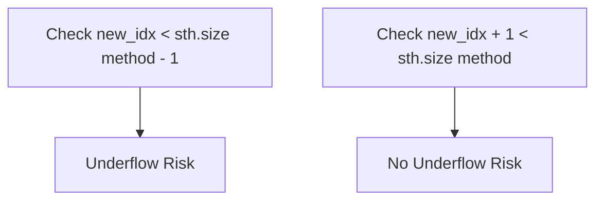
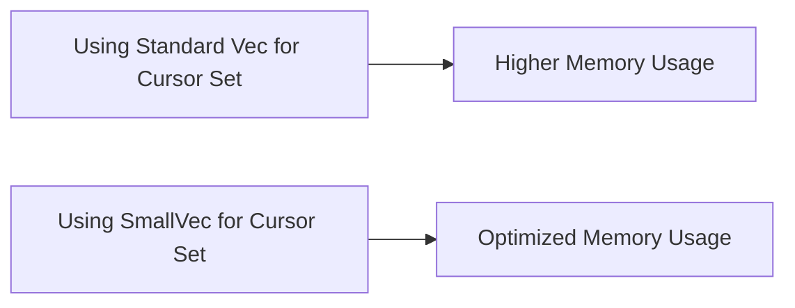
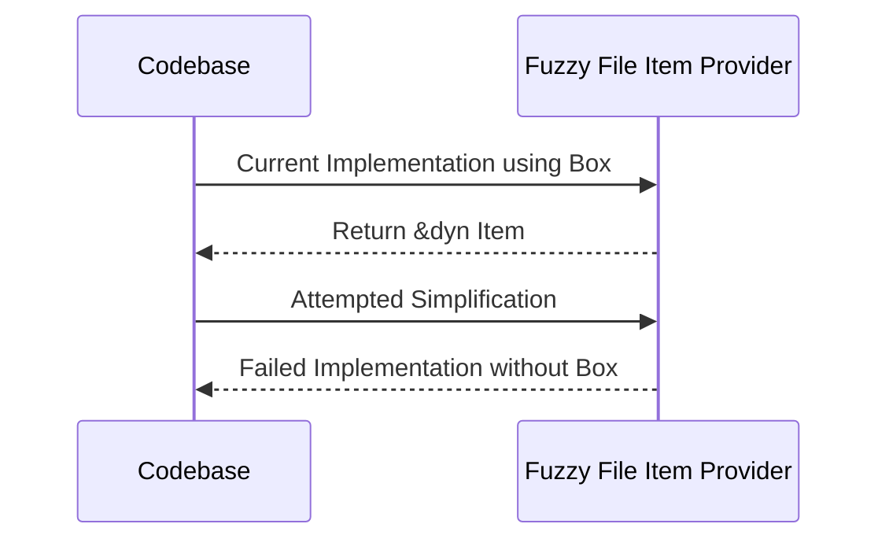

# Code Cleanups and Refinements

As software evolves, there's a continual need to refine and optimize the codebase. In this documentation, we'll address several key areas of the code that require cleanup and offer clearer, more efficient alternatives.

## 1. Addressing Underflow Issues
In the code, there's a risk of underflow when checking the condition `new_idx < sth.size() - 1` especially if `sth.size()` evaluates to 0. To mitigate this, we should modify the condition to `new_idx + 1 < sth.size()`. This ensures that we never subtract from a potential zero value, eliminating the risk of underflow.

## 2. Optimization of Cursor Set
The use of `smallvec` can offer a performance improvement over traditional vectors, especially when dealing with small collections. By switching to `smallvec`, we can optimize the cursor set's memory usage and potentially improve performance.

## 3. Simplifying the Fuzzy File Item Provider
In the current code, the fuzzy file item provider definition has an unnecessary secondary `Box`. We've made attempts to remove it and directly return `&dyn Item` but faced issues. Despite two failed attempts, it remains a point of optimization to consider for future refinements.

