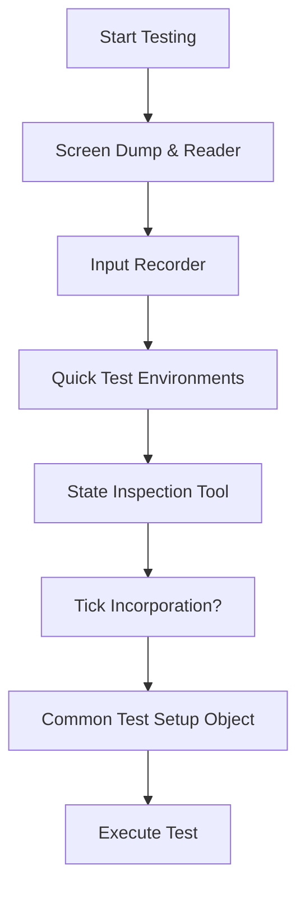

# Testing Paradigms for Large Projects
Given the expansive nature of the project, having a comprehensive testing approach is crucial, albeit challenging. To circumvent this challenge, I've devised a unique testing strategy, focusing on test setup optimization. I've termed this approach "the scaffolding".

## The Scaffolding Approach:
This approach focuses on laying down the foundational elements of a test, ensuring that the setup is 90% complete and only specific customizations are needed for individual test cases.

### Components of the Scaffolding:
1. **Screen Dump & Reader**:
    - Purpose: Visualize the testing process in real-time.
    - Status: Completed and manually verified.
2. **Input Recorder**:
    - Purpose: Record and replay user inputs to reproduce scenarios.
    - Status: Implemented.
3. **Quick Test Environments**:
    - Purpose: Rapidly generate test environments.
    - Implementation: Utilize a fake filesystem initialized from an actual filesystem to expedite the setup.
    - Status: Completed, awaiting testing.
4. **State Inspection Tool**:
    - Purpose: Examine the end-state post-test.
    - Implementation: Query the screen dump for focused, highlighted, or uniquely marked segments.
    - Status: Completed and tested.
5. **Tick Incorporation**:
    - Purpose: Consider the potential of embedding items within ticks for testing.
6. **Common Test Setup Object**:
- Purpose: Avoid redundancy in test setup.
- Implementation: Pre-defined setups, e.g., "setup no. 1", to be reused across multiple tests.

