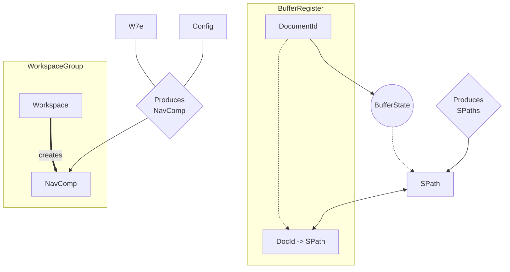

# Understanding User Needs: Who Needs What

In Gladius, understanding the relation between different components is essential for efficient resource management and data flow. This document provides a simplified "map" that visualizes the relationships between the various entities used by Gladius, aiding in determining ownership and interaction hierarchies.

This visual representation helps in tracing the flow of data and interactions between the components, ensuring efficient design and seamless user experience.

