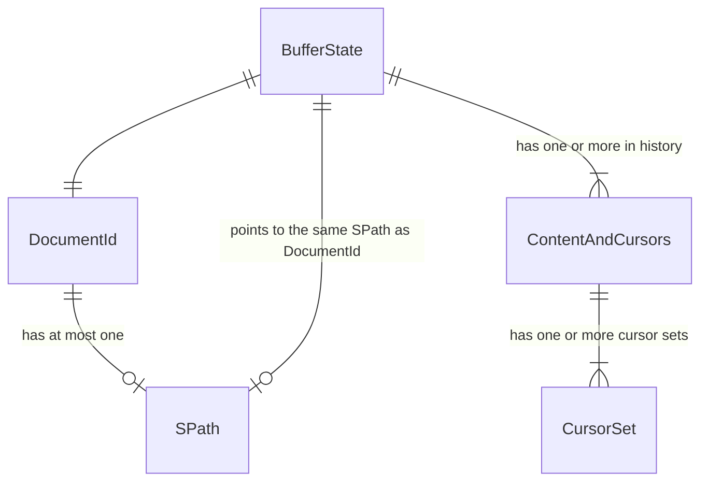

# Cursors and Content and History

In this document I summarize some of the design choices around cursors, content and buffer state.

## Single state, multiple views (WIP)

There can be exactly one BufferState corresponding to a file. At the same time, there might be multiple views of this
file. For instance, whenever I do "find usages", results are presented as a big list of views into files. These views
look into **the same BufferState** that might be opened somewhere else.

## Cursors are per (widget_id, state)

This is quite obvious. Cursor pulls Kite, and therefore are a primary method of scrolling. So in order to have
meaningful multiple views, cursor sets cannot be shared between views.

At the same time, edits in one view must update cursors of the other.

## History

An unsolved problem that appeared while implementing (guess what, I did not think about everything *again*) is UNDO/REDO
semantics.

At this point, mutliple views share the same history, not because it makes sense, but because other ideas seem to be
impossible.
I *could* do per-view UNDO/REDO by generating "reverse events", but then I would have to be able to "migrate" these
events between
histories generated by other users. I'd basically end up in "git" land with all the "patch" semantics.

I refuse to deal with it for two reasons:

1) it's completely beyond my capacity
2) I believe that UNDO/REDO might be more universal than just edits. An unwarranted scroll that destroys your attention
   should be "undoable" without "fishing for previous position".

## Document ID

TODO update this

I am honestly not sure why I need it. I guess the idea was that I can use "scratch pads" that LSP offers. It also
enables changing file path without loosing the link between some identifier and BufferState. Maybe it will be later
merged with BufferStateRef (which right now is just Arc<RwLock<>>) but I am not sure of that

