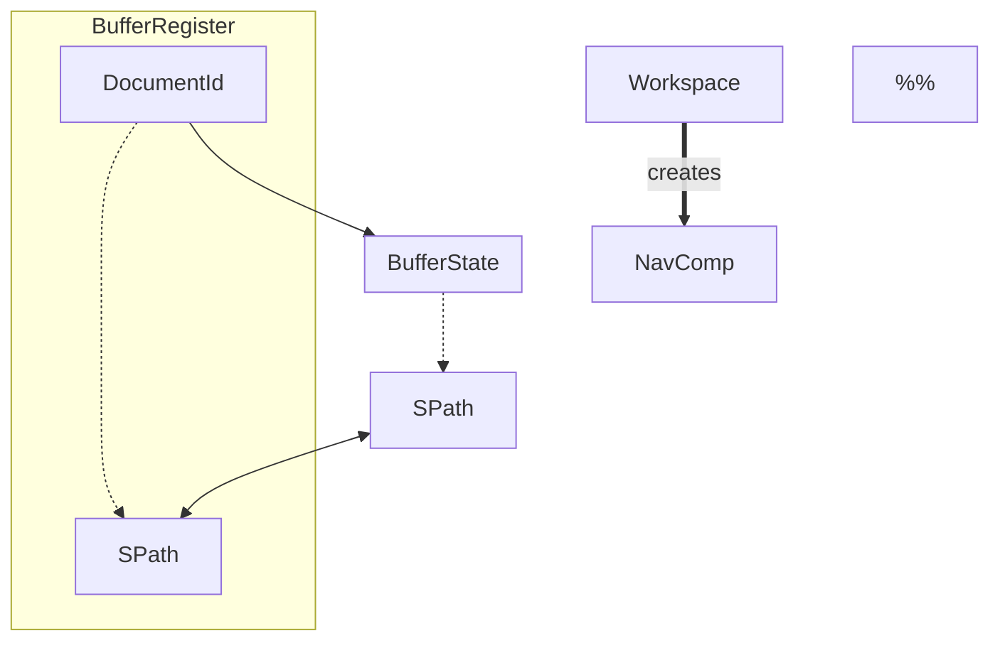

# Who needs what

This file is a simplified "map" of items Gladius uses to do it's things, and their relations, so I can decide where
to put them in terms of ownership.

```mermaid
flowchart
    BufferState
    subgraph BufferRegister
        DocumentId -.-> DocIdSPath[SPath]
    end

    SPath <--> DocIdSPath

    subgraph BufferState
        
    end

    Workspace == creates ==> NavComp

    DocumentId --> BufferState
    BufferState -.-> SPath

    %%
    %%W7e --- ProducesNavComp
    %%Config --- ProducesNavComp
    %%
    %%NavComp
    %%
    %%ProducesNavComp{Produces\nNavComp } --> NavComp
    %%ProducesSPaths{Produces\nSPaths} --> SPath
    %%
    %%SPath

```