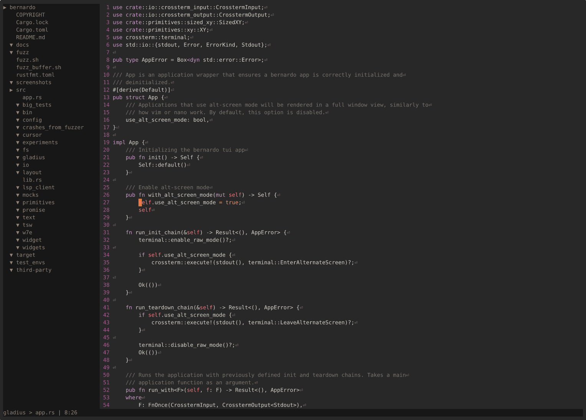
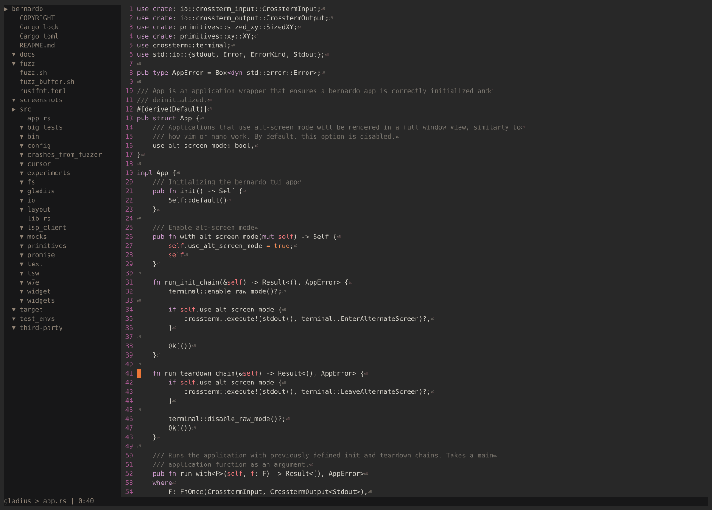
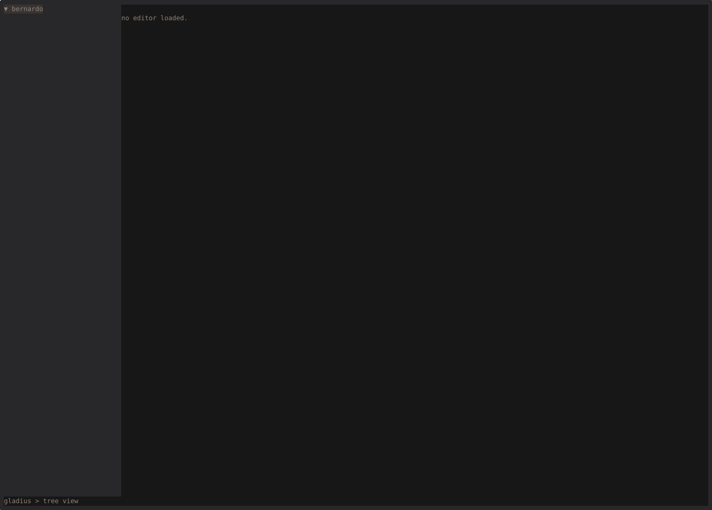
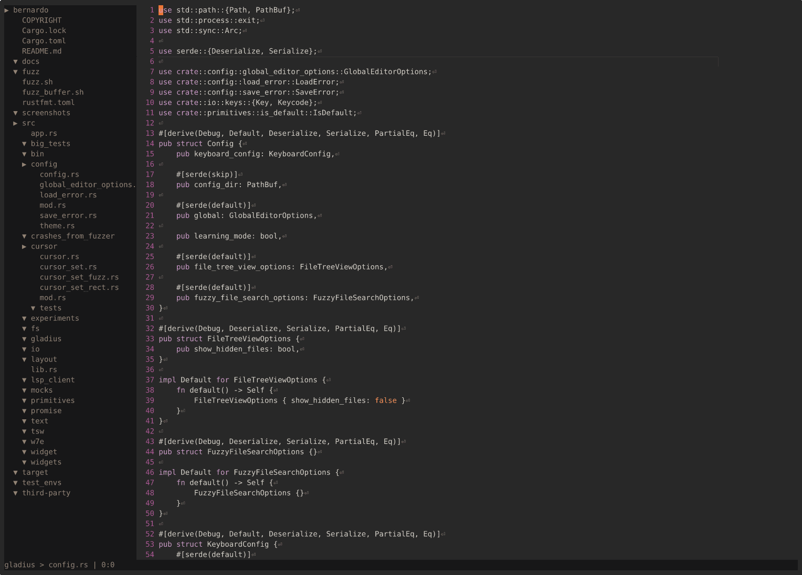
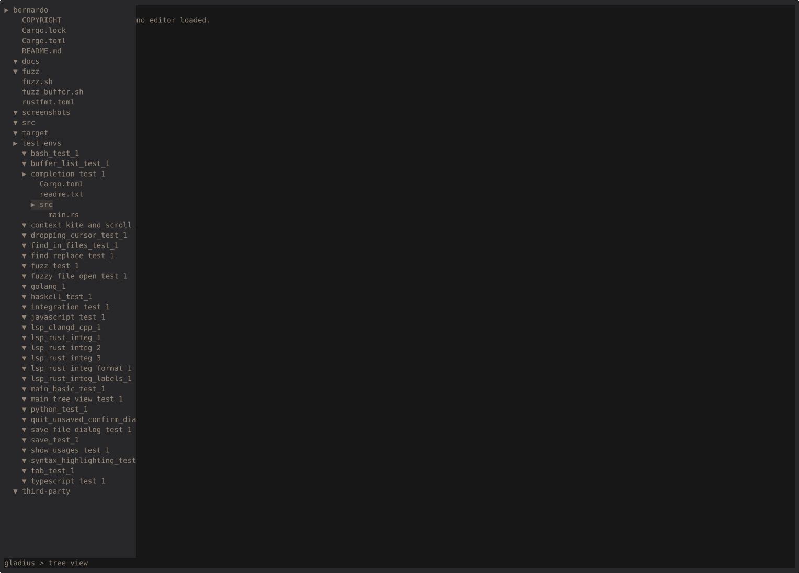
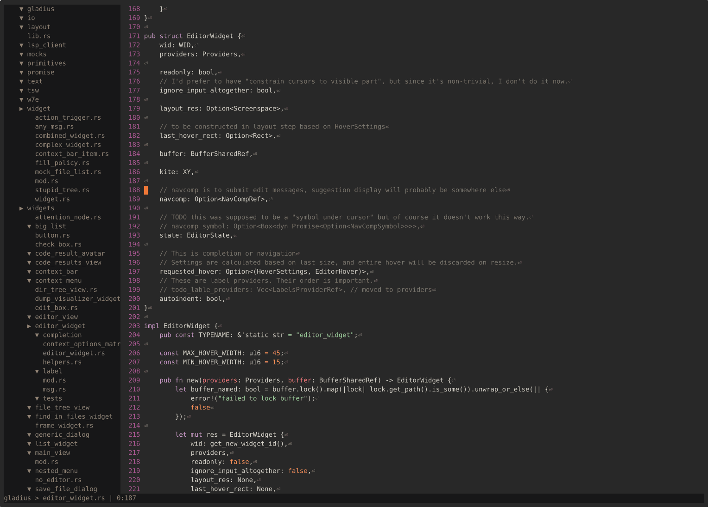
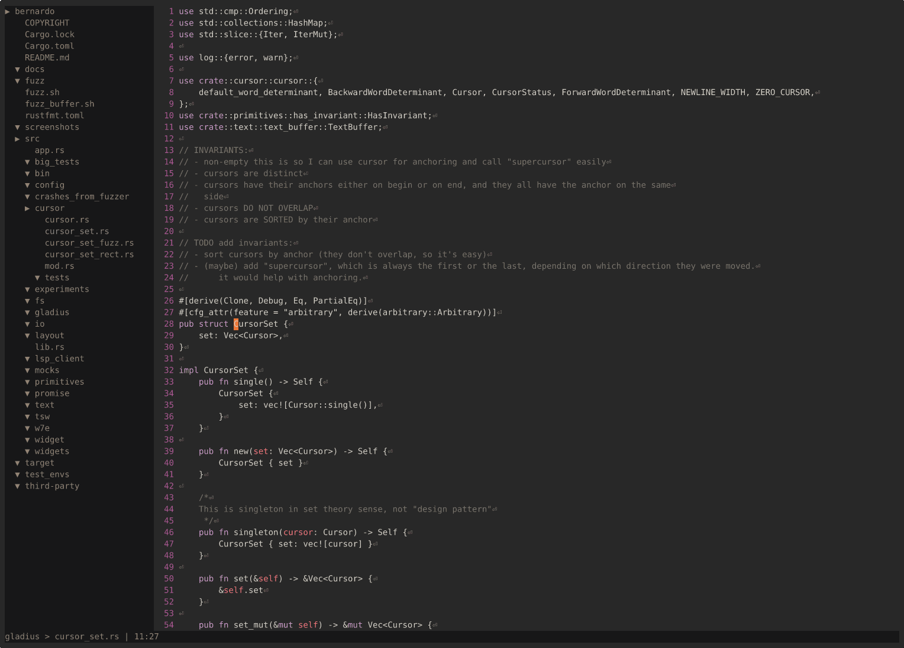

# Gladius Beta 1

In this document I want to briefly describe the key features of Gladius Code Editor in it's first Beta release.

## Features

Beta release is designed to be MVP, so it contains just the use cases I consider essential.

I will showcase the features assuming default key bindings.

### Everything Bar

Wherever you are, you can always press ```CTRL+E``` - the Everything Bar. It's something between Context Menu of
whatever you have cursor over and Rofi or Sublime Text's "quick open".



It's structured, but it's also "fuzzy searched", so you don't need to remember the keyboard shortcuts.

Also, all options irrelevant to the context of your cursor are filtered out, so if your cursor is pointing to code, it
won't have options for file browser and vice versa.

### Learning mode

Don't have time to take 6 week sabbatical to attend a Vim course? Me neither. But if you want to learn Gladius,
you can just set in config:

```~/.config/gladius/config.ron
(
    ...
    learning_mode: true,
)
```

When it's on, all actions that HAVE an assigned keyboard shortcut, can be triggered ONLY with that shortcut (ie
selecting them and hitting Enter in Everything Bar will NOT trigger them).

This way you can use Everything Bar to lookup the shortcuts, but still train your muscle memory.

### Multicursor

No explaination needed, just the keybindings. I don't expect you to write a magical regex to highlight locations you
want to put your cursors in.
Just press ```CTRL+W``` to enter "cursor dropping mode", indicated by different background.
Now just move your highligthed cursor (with arrows!) over the positions you want and hit ```Enter``` to add or remove
cursors.
Press ```Esc``` to get back to default mode and enjoy your multicursor. All basic text operations are supported,
including highlighting, jumping words, copying, pasting etc.



### Fuzzy files

```CTRL+J``` opens "fuzzy file finder". Just type anything, and Gladius will dive into subdirectories and find you any
files that start contain the typed characters as (non-strict) substring.

The window will immediately contain all files that was found in 50 ms or less, but in case that's not enough, the search
will continue in a separate thread. However, I did not implement auto-refresh, so just use arrows to get most up-to-date
result.



### Fuzzy open screens

```CTRL+B``` opens a list of "screens". You have there all your open buffers, but also results of searches and
navigation.



## Features available with LSP

Some languages (right now Rust, C++, Go and Python) come
with [Language Server Protocol](https://microsoft.github.io/language-server-protocol/) support. This provides Navigation
and Completion (in
short [NavComp](https://fallout.fandom.com/wiki/The_navigation_computer_needs_the_NavComp_part_to_work), but that's
actually coincidence).

The editor is smart enough to try finding right LSP on your path, but you can help it out by setting it in
```~/.config/gladius/config.ron```.

### Code completion

Press ```CTRL+SPACE``` to get code suggestions from LSP provider.


### Inline errors/warning

All errors/warnings will be displayed at the end of the line, as provided by LSP.



If you don't like it, just disable it at:

```~/.config/gladius/config.ron
(
...
    global: (
        ...
        inline_warnings_and_errors: true,
        ...
    ),
...
)
```

### Go to definition

Just hover over a symbol, press ```CTRL+E``` (Everything Bar), and select "Go to definition".



### Find usages

Just hover over a symbol, press ```CTRL+E``` (Everything Bar), and select "Find usages".



## Some less amazing features

- ```CTRL+H``` will toggle "hidden files" filter in File tree to the right.
- ```CTRL+D``` will open "Save file as dialog" (sorry, shift+ctrl+s did not work)

## Settings, themes and parameters

### Quick note on Settings

On first run, Gladius will create ```~/.config/gladius/config.ron``` and ```~/.config/gladius/themes/default.ron```.
They are quite self-explanatory. I use [ron](https://docs.rs/ron/latest/ron/) to
Serialize [config.rs](../../src/config/config.rs) and [config.rs](../../src/config/theme.rs).

### UI Themes

The default UI Theme of Gladius is "meh", I did not spend much time polishing it. But it's easy to modify.

### TextMate Themes

For the code themes, I use [syntect](https://docs.rs/syntect/latest/syntect/) to read tmTheme files. It comes with
```["InspiredGitHub", "Solarized (dark)", "Solarized (light)", "base16-eighties.dark", "base16-mocha.dark", "base16-ocean.dark", "base16-ocean.light"]```
built in. Furthermore, Gladius will load any ```~/.config/gladius/tm_themes/*.tmTheme``` files and add to the list
above. You can then select them by setting in ```~/.config/gladius/themes/default.ron```:

```ron
(
    ui: (
... 
    ),
    tm_theme_name: Some("Monokai"),
)
```

to attempt loading "Monokai.tmTheme" from ```~/.config/gladius/tm_themes/Monokai.tmTheme```. In case loading fail, the
logs will contain error message, list of valid names and a default theme will be loaded instead.

### Quick note on parameters

Gladius accepts some parameters:

```
$ gladius --help
Usage: gladius [OPTIONS] [PATHS]...

Arguments:
  [PATHS]...  

Options:
  -e, --log_to_stderr       When turned on, logs are written to stderr. The verbosity of logs is hardcoded in logger_setup.rs
  -f, --log_to_file <FILE>  When set, logs are written to FILE
  -r, --reconfigure         When set, current config will be renamed to 'config.ron.old.<timestamp>' and a fresh, default config will be written to default location prior to run. Useful when a new version is released
      --record              
  -h, --help                Print help
  -V, --version             Print version
```

It's a Beta release, so a runs like

```
gladius --log_to_stderr 2> /dev/pts/1
```

are the quickest way to learn "what is wrong". I tried to tune down most of errors that are irrelevant to everyday user,
but some are left for me to remember.

In general, most of the logger settings (default logging levels for each of components) live
in [logger_setup.rs](../../src/gladius/logger_setup.rs).

## Known bugs

No release is perfect. But after almost 5 years of writing I had to release something. The project turned out to be more
than 5x larger than originally anticipated, so I cut corners deep to get it to beta state.

I did proper fuzzing of Buffer State and general input with quite paranoid debug_asserts all over the code, so obvious
crashes should be smoked out. Also most gaping performance bottlenecks are somewhat optimised.

Nevertheless, here are things I know are not great:

- When a search happens in parallel thread, I don't always trigger "redraw tick". This is the case in fuzzy file search.
- I did not do any memory optimisations. The project might be even leaking memory for all I know.
- I did not implement "filesystem refresh" in the background. If someone else is editing the file, Gladius will not
  notice it and not warn you before overriding.
- I did not implement proper handling of window resize event. It's probably easy, I just had no time.
- There was code filtering out .gitignore folders from code search, but I think it's disabled now.
- Docs are lacking and general code quality is "get it over with" in some places
- Weird style of code. When I started the project, async support in Rust was limited, and number of complications async
  introduced heavily outweighed benefits. I still think async doesn't make sense in client application, but some new
  addition to language (like generators/coroutines) might allow me to trim the codebase.
- Terrible commit messages, curse words and other bad jokes in codebase. Sorry, I dedicate all my professional time to
  employment. This is done in non-professional time and it shows.