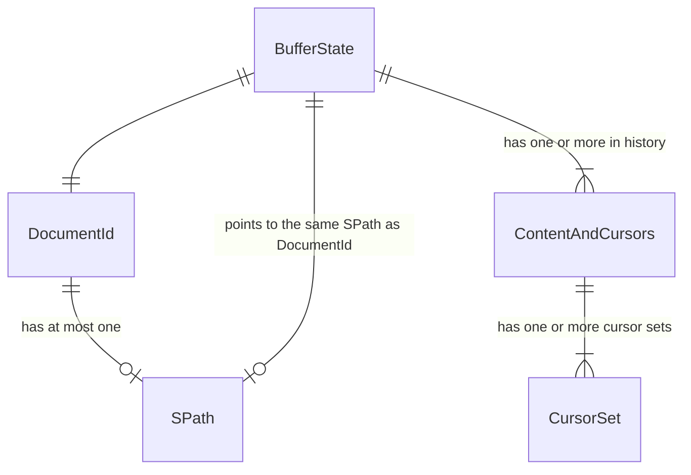

# Cursors and Content

In this document I summarize some of the design choices around cursors, content and buffer state.

## Single state, multiple views (WIP)

There can be exactly one BufferState corresponding to a file. At the same time, there might be multiple views of this
file. For instance, whenever I do "find usages", results are presented as a big list of views into files. These views
look into **the same BufferState** that might be opened somewhere else.

## Cursors are per state

This is quite obvious. Cursor pulls Kite, and therefore are a primary method of scrolling. So in order to have
meaningful multiple views, cursor have to be separate.

At the same time, edits in one view must update cursors of the other. Therefor (TODO issue #23) I expect cursor sets to
be mapped to views within CursorsAndContent structure. I guess I'll use either WidgetID or some UUID to achieve that.

## Document ID

I am honestly not sure why I need it. I guess the idea was that I can use "scratch pads" that LSP offers. It also
enables changing file path without loosing the link between some identifier and BufferState. Maybe it will be later
merged with BufferStateRef (which right now is just Arc<RwLock<>>) but I am not sure of that

