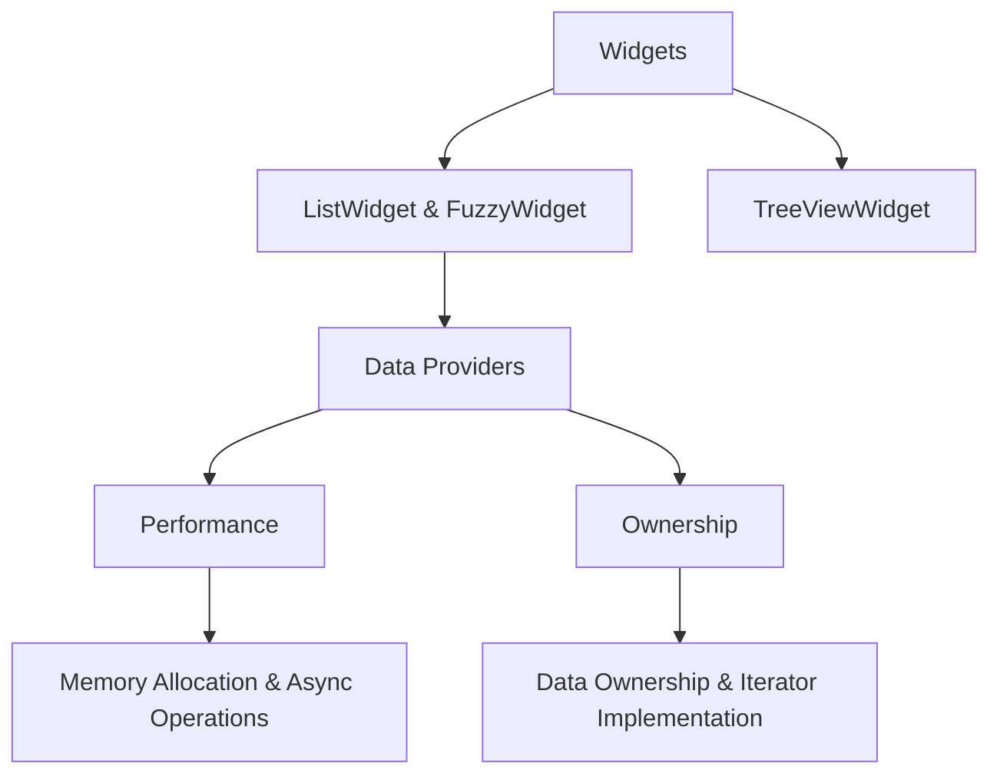

# Data Providers: Streamlining Data Delivery to Widgets
The concept of "data providers" has been observed recurrently within our application, particularly in widgets such as the `ListWidget` and the `FuzzyWidget`. However, its absence in the `TreeViewWidget` has underscored the need for standardizing the mechanism through which data is channeled to widgets.

## Key Considerations

### Performance:
- **Memory Allocation**: We strive for minimal reallocation, particularly when the content remains static. Allocating memory on a per-frame basis is not desirable.
- **Async Operations**: Synchronous data operations are preferred for display purposes. In scenarios where data from another thread is anticipated, we adopt a non-blocking poll approach.

### Ownership:
- **Data Ownership**: Widgets must possess a provider. While the provider can be an instance of `Arc<>`, using `Arc<RwLock<>>` introduces potential delays. A combination of a Channel and a Cell cache (to facilitate internal mutability) seems safer.
- **Iterator Implementation**: The preference is for providers to implement the standard `Iterator` trait as opposed to the `StreamingIterator`. This ensures that data for display is always readily available in allocated memory, guaranteeing swift access.

## Structuring the Data Provider
Given the considerations, a potential structure for the data provider can be:

```rust
struct Provider<T> {
    current_state: RwLock<Arc<Vec<T>>>,
}

impl Provider<T> {
    pub fn get_stuff(&self) -> Arc<Vec<T>> {
        self.current_state.read().unwrap().clone()
    }
}
```

With this structure:
- We have an iterable entity that's preallocated.
- It supports atomic swaps from other threads.
- The reader seldom encounters waiting times during access.
- We can also verify if readers are accessing the most recent state or an outdated version.



## Concluding Thoughts
The adoption of a standardized data provider ensures that data is relayed efficiently to widgets, optimizing performance and enhancing the user experience. This approach minimizes memory reallocations and ensures immediate data availability for display.