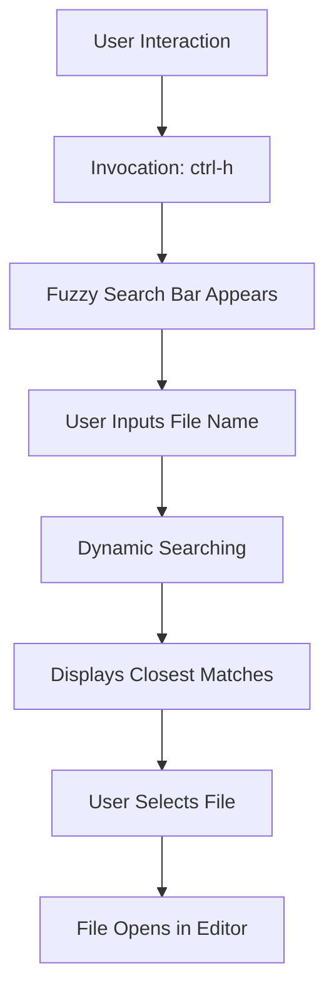

# File Access Techniques: Fuzzy Open Files
Fuzzy open files is a feature designed to enhance file accessibility and improve user efficiency in larger projects. By leveraging fuzzy search algorithms, this tool allows users to quickly locate and open files based on partial or approximate name matches.

## Overview
- **Invocation**: `ctrl-h`
- **Valid Contexts**:
    - Editor window
    - In the future: Multi-editor window
- **Escalation Paths**:
    - Escalates to: None
    - Escalates from: Fuzzy Opened Editors
- **Escape Path**: None

## Functionality
Upon invoking the feature, a search bar appears, allowing the user to type in a file name or a part of it. As the user types, the feature employs a fuzzy search algorithm to find the closest matches from the indexed files. The results are dynamically updated, ensuring a real-time response to the user's input.

### Key Features:
1. **Dynamic Searching**: The search results are updated in real time as the user types, offering instant feedback and quick access.
2. **Name-based Filtering**: The search focuses solely on the file names, disregarding the file paths. This ensures a concise and relevant list of results.
3. **Potential for Path-based Filtering**: While the current version focuses on file names, there is potential to escalate the search to include file paths, providing an even more comprehensive search experience.

## Conclusion
The fuzzy open files feature greatly simplifies the process of locating and accessing files, especially in larger projects. By allowing users to quickly find files with just a few keystrokes, it significantly enhances productivity and streamlines workflow.

