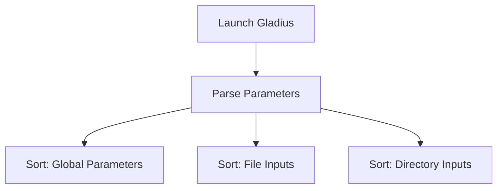
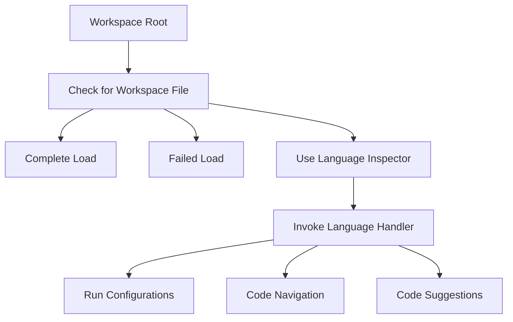

# Gladius Loading Procedure
Gladius incorporates a sophisticated loading mechanism that prioritizes user-defined parameters, workspace settings, and language-specific configurations to optimize its initialization and runtime procedures.

## Parsing Parameters
When Gladius is launched, it can be accompanied by a varied set of parameters:

- **Global Parameters**: These can be zero or more, and they dictate the overarching settings of the software.
- **File Inputs**: Specifies the files Gladius should focus on. There might be none or multiple files.
- **Directory Inputs**: Specifies the root workspace directory. Only one directory can be specified.

The *Args* structure will properly categorize these parameters.

## Determining Workspace Root
The **workspace root** is established in the following sequence:

1. If multiple directories are provided, the program will terminate with an error.
2. If a single directory is specified, it is set as the **workspace root**.
3. If no directory is provided, the OS's current working directory (cwd) is set as the **workspace root**.

## Handling File Inputs
- Files within or above the **workspace root** will be processed. Any failures are logged to the **standard log**.
- Files outside the **workspace root** are ignored, with errors being logged.

## Working with Workspace
Gladius employs a specific workspace format defined in the *w7e* module. The workspace is represented by a *.gladius_workspace.ron* file situated in the **workspace root**. Nested workspaces are not supported currently.

### Presence of Workspace File
- **Complete Load**: If the workspace file is successfully processed, but some language handlers face issues, partial loading ensues. Errors are logged.
- **Failed Load**: If the workspace file cannot be processed, Gladius stops, suggesting users recreate the workspace.

### Absence of Workspace File
If a workspace is not detected, Gladius attempts to establish one using **language inspectors**.

Role of Language Inspector

These inspectors, defined in the *w7e* module, quickly identify the need for a particular **language handler**. They minimize filesystem queries by inspecting directories up to a certain depth. A match halts further directory recursion. Multiple inspectors can match a directory.

## Employing Language Handler
Each programming language has a unique project management method. Gladius's **language handler** bridges this gap by using specialized tools like "cargo" or "cabal". They provide advanced options for directories within the **workspace**, including:

- Run configurations
- Code navigation
- Code suggestions

The handler is activated either by an **inspector** or the project scopes in the Gladius **workspace** file.

