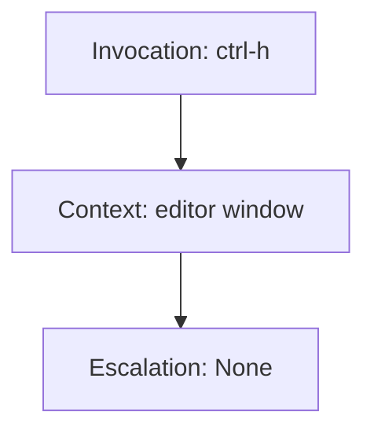

# Template Structuring for Particular Designs
In Gladius, the "Particular Design" template serves as a blueprint to capture and convey specific design ideas directly from the developer's imagination. It provides a structured format to detail the envisioned functionalities and interactions.

## Structure of the Template
### Invocation
**How to Invoke**: This specifies the key combination or method used to call upon the feature or functionality. It's a direct instruction for the user.

- Example: `ctrl-h <what keystroke>`

### Context
**Valid in What Context**: This denotes the environment or the specific window where the feature or action is applicable. It helps users understand the scope of the feature.

- Example: `editor window <where>`

### Escalation
**Escalates to**: This indicates the resultant action or the next sequence that occurs post the initial action. It gives clarity on the flow of operations.

- Example: `None <what is the result of calling "escalate">`

