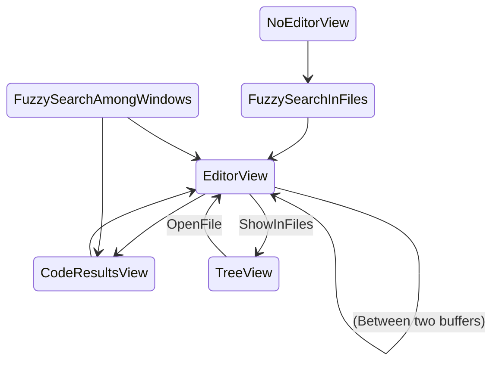

# Story (feel free to skip)

The big "why" behind Gladius project was subject of attention. I wanted to detach myself from a web browser and websites
that are scientifically designed to steal, aggregate and sell my attention.

But the longer I worked on Gladius, the more I realize that perhaps there is a concrete concept in UI not explored
enough of the same name.

Just today I cursed at IntelliJ that whenever I save file and it's reformatted with `rust-fmt` the view jumps to soem
random location 200 lines below my cursor (even though the cursor is where it was, so it's not completely messed up).
That's a typical attention breaker. Whatever flow I might have had, it's now gone.

Ctrl-Z is one of the most often used key-combinations in personal computers. It saves us from "I pressed something and
now everything I've been working on past 40 minutes is gone".

But Prev/Next combination in a web browser, which is a clear continuation of this idea, is completely broken. Nowadays
pressing "previous site" almost never leads to "thing that was there last action ago". The forms data is gone (or sent
twice), session token is expired, and oh btw we rerouted the request 4 times so "previous" is not what you think.
Generally you're in the wrong neighbourhood pal. If you press this button you pay the price twice, not undo the first
mistake.

Things get *a little* better, when you right-click "previous button" in Firefox. It will show you 5 options of which 1
has 50% chances that is what you want. Still without form data and subject to good will, competence and resources of web
developers, but at least it allows to jump over the redirect hoop. If you cover it with two petabytes of AI you might
end up with something useful.

# Abstract

This is a high level definition of "attention chain" type, it's goals, non-goals and implementation details.

## Goals

- Creation of "attention undo", which brings you back to wherever your eyes were before.
- Ability to see "attention chain", that is
    1) relevant
    2) useful

## Let's aggregate the use cases

Allowed "attention transitions" are depicted in following graph (probably not complete)

